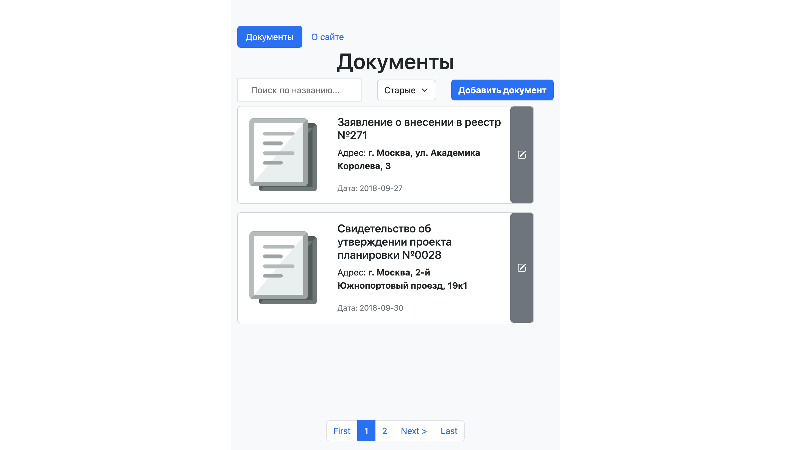
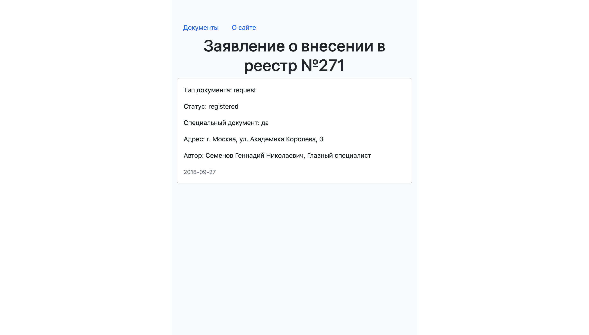
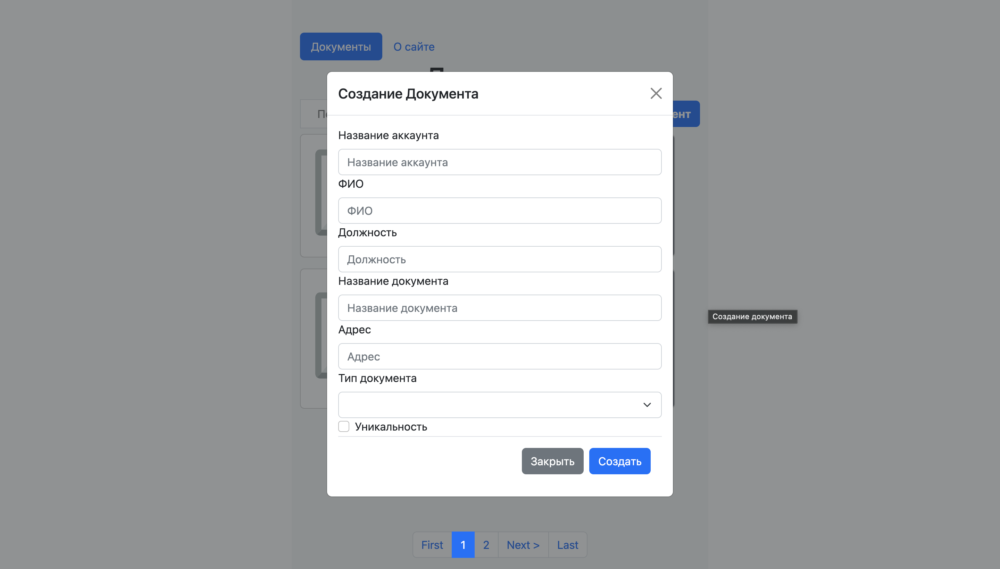
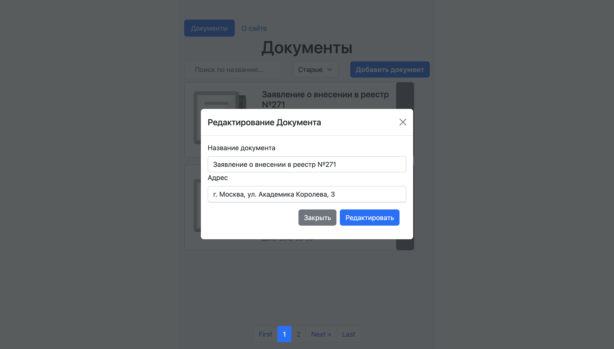

# Docs App

## Main page of app

Contains navbar, filtering of docs input, creating new doc button, the list of docs and pagination:

    

## Page with doc info

Contains info of certain doc:

    

## Creating doc form

Creates new doc:

    

## Editing doc form

Edits doc card info:

    

 
 

This project was generated with [Angular CLI](https://github.com/angular/angular-cli) version 13.3.9.

## Development server

Run `ng serve` for a dev server. Navigate to `http://localhost:4200/`.
